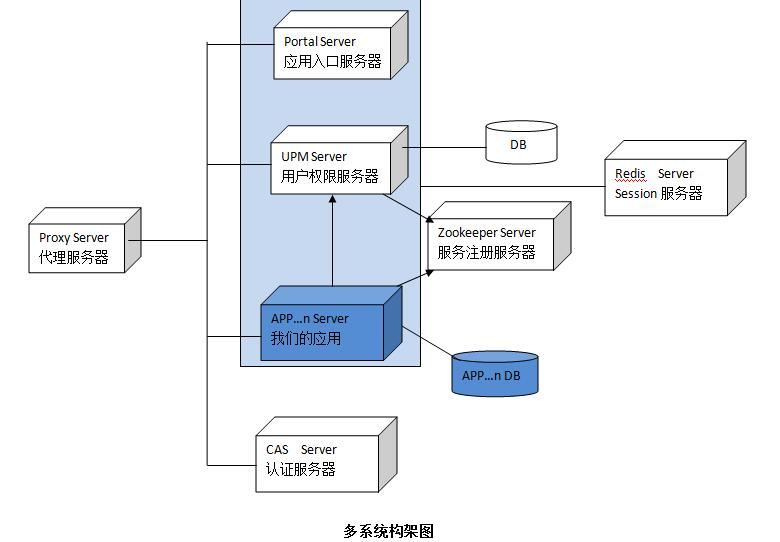

#项目演示地址
http://www.17jee.com     QQ交流群: 540553957
#目的
E框架的目的是让开发不必从零开始开发，让开发者只关注自己的业务功能。
#技术说明
* 此框架采用前后台分开，前后台都可以单独部署，前端采用轻量级的扁平化设计（html+javascript+Bootstrap）, 会自动针对不同的屏幕尺寸调整页面，使其在各个尺寸的屏幕上表现良好。 
* 后端采用Spring boot，它使我们更容易去创建基于Spring的独立和产品级的可以即时运行的应用和服务。直接嵌入Tomcat 或Jetty服务器，不需要部署WAR 文件，可直接运行jar文件。
* 系统权限框架采用Shiro，实现前后台权限校验。
* 持久层采用JPA ，并实现类ibatis的查询功能；数据响应该采用json格式。
* 服务采用REST形式，能够方便的与手机app进行对接，集成swagger能够在线查看RESTAPI 文档和在线测试服务接口
* 支持单点登录，可以多系统进行菜单集成，形成一个portal。
* 支持高并发和水平扩展，支持Session的统一存储。
* 项目采用gradle构建，能够方便的将各项目进行按需组装。

#项目构建
* 找到e\e-upm\src\main\resources\application.yml文件，修改数据库用户名、密码和url为实际值
* 运行start.bat 文件，这里需要很长的等待时间
* 构建成功后在浏览器中输入http://localhost:19090/upm  进入登录页

#开发环境
* 安装gradle插件；导入e目录；运行UpmApplicationMain文件；进入http://localhost:19090/upm；
* 或者不安装gradle插件，直接在e目录下运行gradlew  eclipse 生成eclipse项目；导入e目录；运行UpmApplicationMain文件；进入http://localhost:19090/upm；

#项目说明
* cms,cms-webapp  内容管理系统，这里只是一个demo，就是说这个系统可以基于upm来做开发单系统开发可以按照这个模式来来，你可以将你的代码放入cms,cms-webapp中，他们共用upm的库和代码。
* crm,crm-webapp  客户关系管理系统，这里只是一个demo，目的是为了说明在多个系统的构架中你可以按照这个demo工程来建你的系统。其中crm-webapp中放的静态的html和js;crm中主要是后台服务。
* e-common 主要是一些基础的数据结构和工具类。
* e-core-api 接口API
* e-core-ext 一些如日志，数据字典等功能；其它系统如果需要可以重用。
* e-core-security-api 安全方面的API 如果用户信息，授权等。
* e-core-static 前端html公共页，js ,css.
* e-core 框架主要实现
* e-portal 多系统的一个入口，集成多系统菜单，让所有系统看上去就象一个系统一样。
* e-security-cas 单点登录的支持和授权。
* e-security-form 登录和授权。
* e-security-pwd 密码加密。
* e-session-redis 可以让session统一保存在redis服务器；方便做负载均衡从而达到水平扩展。
* e-spring-fox 生成REST API 文档和在线测试REST API。
* e-upm-api 用户权限管理相关API；e-upm-service 用户权限管理系统服务发部；e-upm-webapp 用户权限管理系统前端页面和js;e-upm用户权限管理系统后台实现。
* server-cas 单点登录服务器；server-proxy 代理服务器,主要是将各系统配在一个域下；server-zkp ZooKeeper服务器，dubbo会用到。这三个系统都是外部系统，放在这里主要是为了能直接运行startAll.bat将这些系统都启动起来，方便演示。实际中
代理服务器可选择专的代理服务器。

#多系统构架

